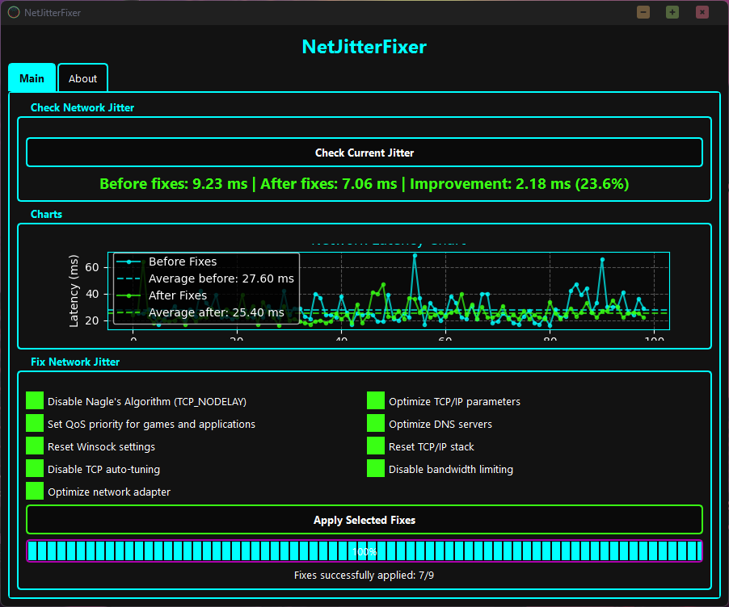

# NetJitterFixer 🚀


> **A powerful tool for diagnosing and fixing network jitter issues in Windows**

<p align="center">
  
</p>

## 🌟 Features

- **Real-time Jitter Measurement**: Accurately measure your network's jitter with detailed statistics
- **Visual Analysis**: Interactive graphs to visualize your latency patterns before and after fixes
- **Multiple Network Optimizations**: Apply various proven fixes to reduce jitter and improve network stability
- **Before/After Comparison**: Clearly see the improvement after applying fixes
- **User-friendly Interface**: Modern neon-themed interface for ease of use

## 🔧 Network Fixes Included

- Disable Nagle's Algorithm (TCP_NODELAY)
- Optimize TCP/IP parameters
- Set QoS priority for games and applications
- Optimize DNS servers
- Reset Winsock settings
- Reset TCP/IP stack
- Disable TCP auto-tuning
- Disable bandwidth limiting
- Optimize network adapter settings

## 📋 Requirements

- Windows 10 or 11
- Administrator rights (for applying fixes)
- Python 3.8 or higher
- Required Python packages:
  ```
  PyQt6
  matplotlib
  numpy
  ```

## 🚀 Installation

1. Clone this repository or download the ZIP file
2. Install the required packages:
   ```
   pip install -r requirements.txt
   ```
3. Run the application:
   ```
   python main.py
   ```

## 📌 Usage Guide

1. Start the application (run as administrator for full functionality)
2. Click "Check Current Jitter" to measure your baseline jitter
3. Select the fixes you want to apply
4. Click "Apply Selected Fixes"
5. Run another jitter check to see your improvements

## 🔍 What is Jitter?

Jitter is the variation in the delay of packet transmission across a network. High jitter leads to unstable connections, causing problems in:

- Online gaming (stuttering, lag spikes)
- Video conferencing (freezing, audio cuts)
- VoIP calls (choppy audio)
- Streaming (buffering, quality drops)

The lower your jitter value, the more stable your connection!

## ⚠️ Disclaimer

Some network optimizations modify Windows registry settings. While these are generally safe and reversible, it's always recommended to:

- Create a system restore point before applying fixes
- Apply fixes selectively rather than all at once if you're unsure

---

<p align="center">
  <b>Made with ❤️ by DAN</b>
</p>

---
